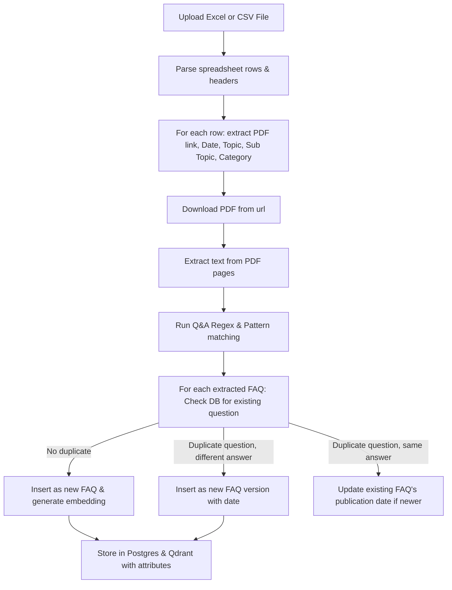

# SEBI FAQ System - Extraction and Attribute Specification

This document details the step-by-step workflow of the FAQ extraction pipeline, outlining the source of each attribute and how version control is maintained.

---

## 1. Step-by-Step Extraction Workflow

### Step 1: File Upload
The user uploads an Excel (`.xlsx`, `.xls`) or CSV (`.csv`) spreadsheet via the frontend `Extract Center` interface.

### Step 2: Row-by-Row Spreadsheet Parsing
The system reads the spreadsheet contents:
- **Excel**: Using the `openpyxl` library.
- **CSV**: Using Python's standard `csv` library.
It processes the spreadsheet row by row instead of compiling a flat list of links.

### Step 3: Header and Value Extraction
Using case-insensitive substring and exact matches, the system maps the column indices to the following variables:
- **`PDF links`** -> PDF URL source.
- **`Dates`** -> Document publication date.
- **`Topic`** -> The high-level regulatory topic.
- **`Sub Topic`** -> The specific sub-topic within the regulation.
- **`category`** -> The core classification category.

### Step 4: PDF Downloader & Scraper
For each row, the system downloads the PDF from the URL. It uses `PyPDF2` to read the PDF pages, extracts raw text, and runs regex-based Q&A parsing patterns to find individual FAQ pairs (Question + Answer).

### Step 5: Duplicate Detection & Version Check
For each scraped FAQ, the system queries PostgreSQL for any existing FAQs with the exact same question.
- **Scenario A: Brand New Question**
  - Stored as a new FAQ record.
- **Scenario B: Question Exists with a Different Answer (e.g. Update)**
  - Stored as a *new* FAQ record with its own `publication_date`.
- **Scenario C: Question Exists with the Same Answer (Duplicate)**
  - If the spreadsheet's publication date is newer than the database's record, the database record's `publication_date` is updated. No new record is created to prevent clutter.

### Step 6: Ingestion into Postgres & Qdrant
- **PostgreSQL**: A new FAQ record is saved in the `faqs` table, and a corresponding `FAQMetadata` record is created.
- **Qdrant**: The text embedding is generated using the sentence-transformers model `all-MiniLM-L6-v2`. The embedding vector along with its payload metadata is stored in Qdrant.

---

## 2. Attribute Mapping Specification

The following table details where every attribute in the system is sourced from, identifying the spreadsheet columns, database columns, and default value rules.

| System Attribute | Source in Uploaded File | Target Database Column (Postgres) | Target Payload Key (Qdrant) | Extraction & Mapping Rules |
| :--- | :--- | :--- | :--- | :--- |
| **`question`** | Scraped from PDF | `faqs.question` | `question` | Extracted via PDF text regex patterns. |
| **`answer`** | Scraped from PDF | `faqs.answer` | `answer` | Extracted via PDF text regex patterns. |
| **`source_url`** | `PDF links` column | `faqs.source_url` | `source_url` | Extracted from the spreadsheet row. |
| **`publication_date`** | `Dates` column | `faqs.publication_date` | `publication_date` | Extracted from row. Parsed dynamically using formats like `DD/MM/YYYY` or `YYYY-MM-DD`. Saved as `DateTime` (UTC). |
| **`topic`** | `Topic` column | `faq_metadata.topic` & `faq_metadata.department` | `topic` | Extracted from row. Copied to both `topic` and `department` fields. |
| **`subcategory`** | `Sub Topic` column | `faq_metadata.subcategory` | `subcategory` | Extracted from row. |
| **`category`** | `category` column | `faq_metadata.category` | `category` | Extracted from row. Maintained exactly to prevent category mismatch. |
| **`risk_level`** | *Not in file* | `faq_metadata.risk_level` | `risk_level` | **Default Value**: `"medium"`. |
| **`compliance_status`** | *Not in file* | `faq_metadata.compliance_status` | `compliance_status` | **Heuristic Rule**: Set to `"mandatory"` if the answer contains terms like `must`, `shall`, `required`, or `mandatory`. Otherwise, defaults to `"informational"`. |
| **`authority`** | *Not in file* | `faq_metadata.authority` | `authority` | **Default Value**: `"SEBI"`. |
| **`compliance_framework`**| *Not in file* | `faq_metadata.compliance_framework` | `compliance_framework` | **Default Value**: `"SEBI_REGULATIONS"`. |

---

## 3. Retrievals and Front-End Sorting

1. **Ordering**: All search outputs are sorted primarily by `publication_date` descending, ensuring the user always sees the newest regulatory answers first.
2. **Historical Version Toggle**: When a question has multiple answers in the database (associated with different dates), the search results only show the latest version. A checkbox/toggle `Show historical answers` is rendered on the answer card. Checking it displays older answers, their dates, and source URLs in chronological order.
